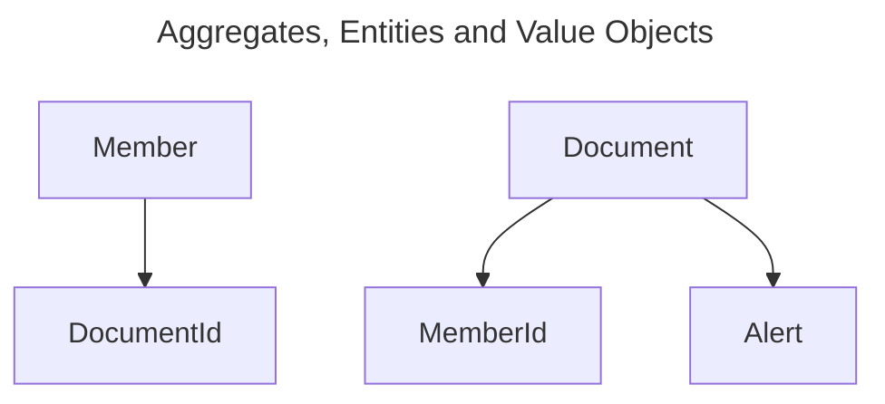

# life-manager

## Dev Container
The dev container contains all dependencies needed and mounts your neovim config. You can build and run the app
from there as well run the integration tests.

- To build dev container:
```
cd backend/.container
docker build -t rust-nvim:latest .
```

- To run and connect to the container:
```
backend/.container/run.sh
```

## How to run
### Backend App Only
```bash
cargo run
```

### Backend Stack with Docker Compose
This needs to be done outside of the dev container if we are using the Ollama container.
```
backend/.start_backend.sh <dev | prod>
```

## Example API calls

```bash
curl --location 'http://127.0.0.1:3000/api/v1/documents/1'
curl -X POST -H "Content-Type: multipart/form-data" -F "json={\"id\": 99, \"title\":\"MYTEST\",\"content\":\"this is an example\"}" -F "file=@README.md" localhost:3000/documents
```


## Installation

### Diesel

See this tutorial: https://diesel.rs/guides/getting-started

Install the Diesel command-line interface for PostgreSQL:

```bash
cargo install diesel_cli --no-default-features --features postgres
```

Run migrations:

```bash
diesel migration run
```

## Planned Features

#### Document Manager
* Store documents and associate them with family members
* Automate reminders to alert users before documents expire

### Medical Manager
* Diary of doctor visits
* Track personal health data (height, weight, etc) over time and visualize with charts

### Location Manager
* Integrate with Google's "find my device" feature to show location of everyone on a map

### Car Manager
* Diary of mechanic visits and history

### Receipt Manager
* Upload and store receipts. Possibly parsing info such as vendor name, date, and amount from
the receipt image


