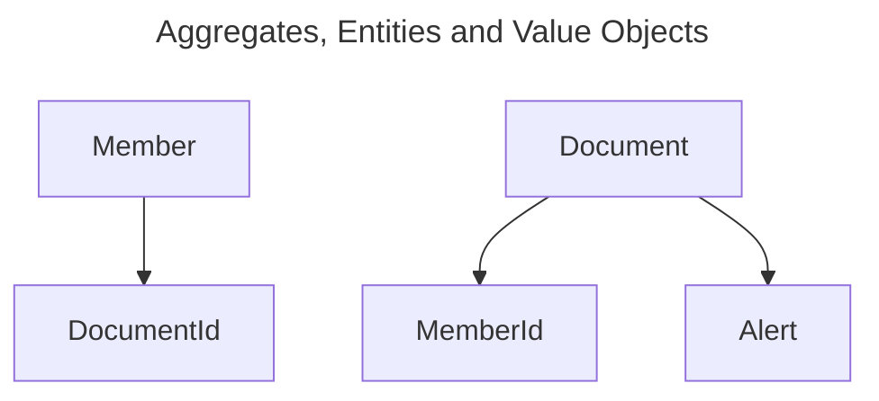

# life-manager

## Dev Container
The dev container contains all dependencies needed and mounts your neovim config. You can build and run the app
from there as well run the integration tests.

Scripts live in [`dev-container/`](dev-container/). They resolve their own directory, so run them from the repo root.

- **Build** (includes host user/GID args, `--network=host`, and `--no-cache`):
```bash
./dev-container/build-image.sh
```

- **Run** and connect to the container:
```bash
./dev-container/run.sh
```

## How to run

### Full stack (`build_and_start_app.sh`)

From the repository root (not inside the dev container if you rely on host Docker):

```bash
./build_and_start_app.sh <test | dev | docker-dev | prod> [--build-image] [--with-tesseract]
```

This starts `backend/start_backend.sh` and `frontend/start_frontend.sh` in parallel (except **docker-dev**, which runs only the backend script and serves the frontend from Docker). Each script receives the same profile. Compose and the backend load variables from `.<profile>.env` at the repo root (for example `.prod.env`). The **docker-dev** profile uses the same **`.dev.env`** file as **dev**.

| Profile | Backend | Frontend | Docker Compose (`docker-compose.yml`) |
|--------|---------|----------|----------------------------------------|
| **prod** | Rust server in container `life-manager` | Static app in container `frontend`; users normally hit **`gateway`** | `life-manager`, `frontend`, `gateway`, `alloy` |
| **dev** | **`cargo run`** on the host (see `APP_PORT`) | **`npx expo start`** on the host (default Expo port **8080**) | *(none — `frontend_dev` is stopped on startup)* |
| **docker-dev** | **`cargo run`** in container `life_manager_dev` (source baked into image; images rebuilt on every start) | Expo in container **`frontend_dev`** | `life_manager_dev`, `frontend_dev`, `alloy` |
| **test** | `cargo build` only; the API is **not** started by these scripts; **no** Compose services are started | Expo on the host (same as dev) | *(none)* |

**Ports (defaults)** — override `APP_PORT` / service ports in `.<profile>.env`, or set Compose variables (for example `NGINX_PORT`) when invoking Docker Compose.

| Port / setting | What uses it |
|----------------|----------------|
| **`APP_PORT`** (default **3000**) | Backend HTTP: host process in **dev**, published by **`life_manager_dev`** in **docker-dev**, published by container **`life-manager`** in **prod**. |
| **`NGINX_PORT`** (default **80**) | Host port for **`gateway`** in **prod** (`/` → frontend, `/life-manager/api` → v1 API, `/api` → health/version). Often the main browser URL. |
| **`FRONTEND_PORT`** (default **8080**) | Host port for the **`frontend`** container in **prod** (direct access; prefer **`gateway`** for one origin). Same variable maps **`frontend_dev`** (Expo in Docker) in **docker-dev**. Host Expo in **dev**. |
| **`TESSERACT_PORT`** (default **8884** in sample env files) | Published when the optional **`tesseract`** Compose service is running. |
| **`TESSERACT_ENABLED`** (default **`false`** in sample env files) | When **`false`**, the backend uses **`NoOpDocumentTextReader`** (embedded PDF text only; no HTTP OCR). When **`true`**, **`TESSERACT_URL`** must point at the sidecar. **`start_backend.sh --with-tesseract`** forces **`TESSERACT_ENABLED=true`** and adds Compose **`--profile tesseract`**. |

### Optional Tesseract (OCR sidecar)

Sample env files default **`TESSERACT_ENABLED=false`**, so **`docker compose`** does not need to run the **`tesseract`** service for normal dev/test/prod. To enable OCR (images or scanned PDFs), run Compose with the extra profile and point the API at the container, for example:

```bash
docker compose -f docker-compose.yml --env-file .prod.env --profile prod --profile tesseract up -d
```

Pass **`backend/start_backend.sh dev --with-tesseract`** (or **prod** / **docker-dev**) to start the stack **and** the sidecar in one step.

### Grafana Cloud logs (prod and docker-dev)

The **`alloy`** service (**prod** and **docker-dev** profiles) ships Docker logs from the **`life-manager`** Compose project to [Grafana Cloud Loki](https://grafana.com/products/cloud/logs/). Query logs in your Grafana Cloud stack (**Explore** → Loki); there is no log UI on the gateway.

Add these to **`.prod.env`** and/or **`.dev.env`** (both git-crypt):

```bash
GRAFANA_LOKI_URL=https://logs-prod-XXX.grafana.net/loki/api/v1/push
GRAFANA_LOKI_USERNAME=<instance-id>
GRAFANA_CLOUD_API_KEY=<access-policy-token>
GRAFANA_LOKI_ENVIRONMENT=production   # use local in .dev.env for docker-dev
```

Obtain Loki credentials from Grafana Cloud → **Connections** → **Loki** (or the Docker integration wizard). Set **`GRAFANA_LOKI_ENVIRONMENT`** to **`production`** in **`.prod.env`** and **`local`** in **`.dev.env`** so local and prod logs are easy to filter. Example Explore queries (use the same value you set in **`GRAFANA_LOKI_ENVIRONMENT`**):

- `{environment="production", service="life-manager"}`
- `{environment="production", service="gateway"} |= "error"`
- `{environment="local", service="life_manager_dev"}`

Config: [`observability/loki-ship.alloy`](observability/loki-ship.alloy) (baked into the **`alloy`** image via [`observability/Dockerfile`](observability/Dockerfile); rebuild after editing: `docker compose --env-file .dev.env --profile docker-dev build alloy`).

**Verify Alloy is shipping logs**

1. **Config loaded** — Alloy logs should mention `loki.source.docker` / `loki.write` on startup (not only `http` / `cluster`):

   ```bash
   docker compose --env-file .dev.env --profile docker-dev logs alloy | rg 'loki\\.|error|level=error'
   ```

2. **Config file is a file inside the container** (not a directory left from an old bind mount):

   ```bash
   docker exec life_manager_alloy head -3 /etc/alloy/config.alloy
   ```

3. **Metrics** — with the stack running, check counters ( **`loki_write_sent_entries_total`** should increase after app containers log):

   ```bash
   curl -s http://127.0.0.1:12345/metrics | rg 'loki_write_(sent|dropped)_entries_total'
   ```

   If **`loki_write_dropped_entries_total`** increases or **`sent`** stays at 0, check Alloy logs for 401/403 (bad token) or URL errors.

4. **Grafana Explore** — pick the **Loki** data source for your Cloud stack, set time range to **Last 15 minutes**, and query using your **`GRAFANA_LOKI_ENVIRONMENT`** value, e.g. `{environment="local", service="life_manager_dev"}`.

5. **Common failures in Alloy logs** — `docker compose ... logs alloy`:
   - **`timestamp too old`** — Alloy replayed old Docker log files; rebuild **`alloy`** after pulling (config drops lines older than 14d). One-time fix: `docker volume rm life-manager_alloy_data` then recreate **`alloy`** so positions reset after the drop stage is in place.
   - **`401` / `403`** — wrong **`GRAFANA_LOKI_USERNAME`** or **`GRAFANA_CLOUD_API_KEY`**.
   - **`max entry size '262144' bytes exceeded`** — a log line exceeded Grafana Cloud's 256 KiB limit (common with **`RUST_BACKTRACE=full`** or huge debug output). Config drops lines over 240 KiB before push. Rebuild **`alloy`**: `docker compose --env-file .dev.env --profile docker-dev build alloy && docker compose --env-file .dev.env --profile docker-dev up -d --force-recreate alloy`.

If an old bind mount left **`observability/config.alloy`** as a **directory** on the host, remove it before recreating Alloy:

```bash
rm -rf observability/config.alloy observability/grafana observability/loki-config.yaml
docker compose --env-file .dev.env --profile docker-dev up -d --force-recreate alloy
```

The Compose file is **`docker-compose.yml`** at the repo root; its header comments describe gateway routing and **`EXPO_PUBLIC_API_BASE_URL`**. For **prod**, `start_backend.sh` runs `docker compose build` for `life-manager`, `gateway`, and `frontend` before `up` when **`--build-image`** is passed so nginx templates stay in sync with the repo. **docker-dev** always rebuilds `life_manager_dev` and `frontend_dev` before `up`.

**Dev note:** Use **dev** for host `cargo run` + host Expo, or **docker-dev** for both in Docker (same **`.dev.env`**). Switching profiles stops the other workflow’s containers and frees ports.

**Prod note:** `frontend/start_frontend.sh` exits immediately in prod and docker-dev; the UI is served from Docker.

Architecture diagrams (workspace layout, routing, deployment): [`docs/architecture.md`](docs/architecture.md).

More detail on API URLs and mobile: [`docs/development_faq.md`](docs/development_faq.md).

### Backend app only
```bash
cd backend && cargo run
```

Uses `APP_PORT` from your environment (see `.dev.env` at the repo root for profile defaults, or `backend/.env` for bare `cargo run`).

## Example API calls

```bash
# Health check
curl --location 'http://127.0.0.1:3000/api/health'

# Get a document by UUID
curl --location 'http://127.0.0.1:3000/life-manager/api/v1/documents/550e8400-e29b-41d4-a716-446655440000'

# Create a document
curl -X POST -H "Content-Type: multipart/form-data" \
  -F "json={\"title\":\"MYTEST\",\"content\":\"this is an example\"}" \
  -F "file=@README.md" \
  'http://127.0.0.1:3000/life-manager/api/v1/documents'
```


## Installation

### Diesel

See this tutorial: https://diesel.rs/guides/getting-started

Install the Diesel command-line interface for SQLite:

```bash
cargo install diesel_cli --no-default-features --features sqlite
```

Set up the database and run migrations:

```bash
cd backend
export DATABASE_URL=./data/test.db
diesel setup
diesel migration run
cd libs/auth
diesel migration run --config-file diesel.toml
```

The server and integration tests also apply both migration sets automatically on startup.

## Planned Features

#### Document Manager
* Store documents and associate them with family members
* Automate reminders to alert users before documents expire

### Medical Manager
* Diary of doctor visits
* Track personal health data (height, weight, etc) over time and visualize with charts

### Location Manager
* Integrate with Google's "find my device" feature to show location of everyone on a map

### Car Manager
* Diary of mechanic visits and history

### Receipt Manager
* Upload and store receipts. Possibly parsing info such as vendor name, date, and amount from
the receipt image


```mermaid
---
title: Aggregates, Entities and Value Objects
---

flowchart TD

  M-->Did
  D-->Mid
  D-->A

    M[Member]
    D[Document]
    Mid[MemberId]
    Did[DocumentId]
    A[Alert]
```
