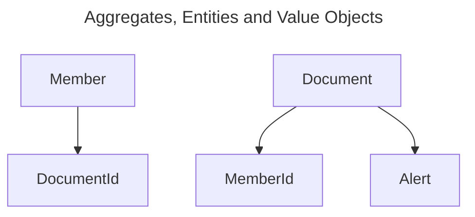

# life-manager

## Dev Container
The dev container contains all dependencies needed and mounts your neovim config. You can build and run the app
from there as well run the integration tests.

- To build dev container:
```
cd backend/.container
docker build -t rust-nvim:latest .
```

- To build dev container while iterating on changes, use the `--no-cache` flag:
```
cd backend/.container
docker build --build-arg USER_ID=$(id -u) --build-arg GROUP_ID=$(id -g) --build-arg USERNAME=$(whoami) --no-cache -t rust-nvim:latest .
```

- To run and connect to the container:
```
backend/.container/run.sh
```

## How to run

### Full stack (`build_and_start_app.sh`)

From the repository root (not inside the dev container if you rely on host Docker):

```bash
./build_and_start_app.sh <test | dev | prod>
```

This starts `backend/start_backend.sh` and `frontend/start_frontend.sh` in parallel. Each script receives the same profile. Compose and the backend load variables from `backend/.<profile>.env` (for example `backend/.prod.env`).

| Profile | Backend | Frontend | Docker Compose (`docker-compose.yml`) |
|--------|---------|----------|----------------------------------------|
| **prod** | Rust server in container `life-manager` | Static app in container `frontend`; users normally hit **`gateway`** | `life-manager`, `frontend`, `gateway`, `tesseract` |
| **dev** | **`cargo run`** on the host (see `APP_PORT`) | **`npx expo start`** on the host (default Expo port **8080**) | `frontend_dev`, `tesseract` |
| **test** | `cargo build` only; the API is **not** started by these scripts | Expo on the host (same as dev) | **`tesseract` only** |

**Ports (defaults)** — override `APP_PORT` / service ports in `backend/.<profile>.env`, or set Compose variables (for example `NGINX_PORT`) when invoking Docker Compose.

| Port / setting | What uses it |
|----------------|----------------|
| **`APP_PORT`** (default **3000**) | Backend HTTP: host process in **dev**, published by container **`life-manager`** in **prod**. |
| **`NGINX_PORT`** (default **80**) | Host port for **`gateway`** in **prod** (`/` → frontend, `/api` → backend). Often the main browser URL. |
| **`FRONTEND_PORT`** (default **8080**) | Host port for the **`frontend`** container in **prod** (direct access; prefer **`gateway`** for one origin). Same variable maps **`frontend_dev`** (Expo in Docker) in **dev**. |
| **`TESSERACT_PORT`** (default **8884** in sample env files) | Tesseract OCR sidecar. |

The Compose file is **`docker-compose.yml`** at the repo root; its header comments describe gateway routing and **`EXPO_PUBLIC_API_BASE_URL`**. For **prod**, `start_backend.sh` runs `docker compose build` for `life-manager`, `gateway`, and `frontend` before `up` so nginx templates stay in sync with the repo.

**Dev note:** Expo on the host and the **`frontend_dev`** service both default to **`FRONTEND_PORT`** (**8080**). If both run, change **`FRONTEND_PORT`** for one side or run only one frontend workflow.

**Prod note:** `frontend/start_frontend.sh` exits immediately in prod; the UI is served from Docker (`frontend` + `gateway`).

More detail on API URLs and mobile: [`docs/development_faq.md`](docs/development_faq.md).

### Backend app only
```bash
cd backend && cargo run
```

Uses `APP_PORT` from your environment (see `backend/.dev.env` for local defaults).

## Example API calls

```bash
# Get a document by UUID
curl --location 'http://127.0.0.1:3000/api/v1/documents/550e8400-e29b-41d4-a716-446655440000'

# Create a document
curl -X POST -H "Content-Type: multipart/form-data" -F "json={\"title\":\"MYTEST\",\"content\":\"this is an example\"}" -F "file=@README.md" localhost:3000/documents
```


## Installation

### Diesel

See this tutorial: https://diesel.rs/guides/getting-started

Install the Diesel command-line interface for SQLite:

```bash
cargo install diesel_cli --no-default-features --features sqlite
```

Set up the database and run migrations:

```bash
cd backend
export DATABASE_URL=./data/test.db
diesel setup
diesel migration run
```

## Planned Features

#### Document Manager
* Store documents and associate them with family members
* Automate reminders to alert users before documents expire

### Medical Manager
* Diary of doctor visits
* Track personal health data (height, weight, etc) over time and visualize with charts

### Location Manager
* Integrate with Google's "find my device" feature to show location of everyone on a map

### Car Manager
* Diary of mechanic visits and history

### Receipt Manager
* Upload and store receipts. Possibly parsing info such as vendor name, date, and amount from
the receipt image


```mermaid
---
title: Aggregates, Entities and Value Objects
---

flowchart TD

  M-->Did
  D-->Mid
  D-->A

    M[Member]
    D[Document]
    Mid[MemberId]
    Did[DocumentId]
    A[Alert]
```
