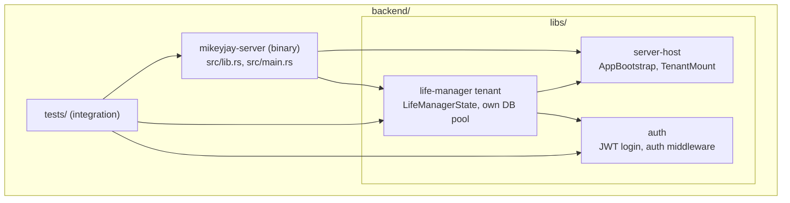
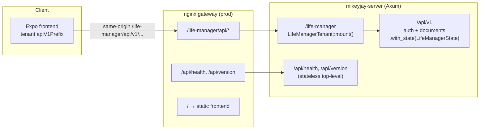
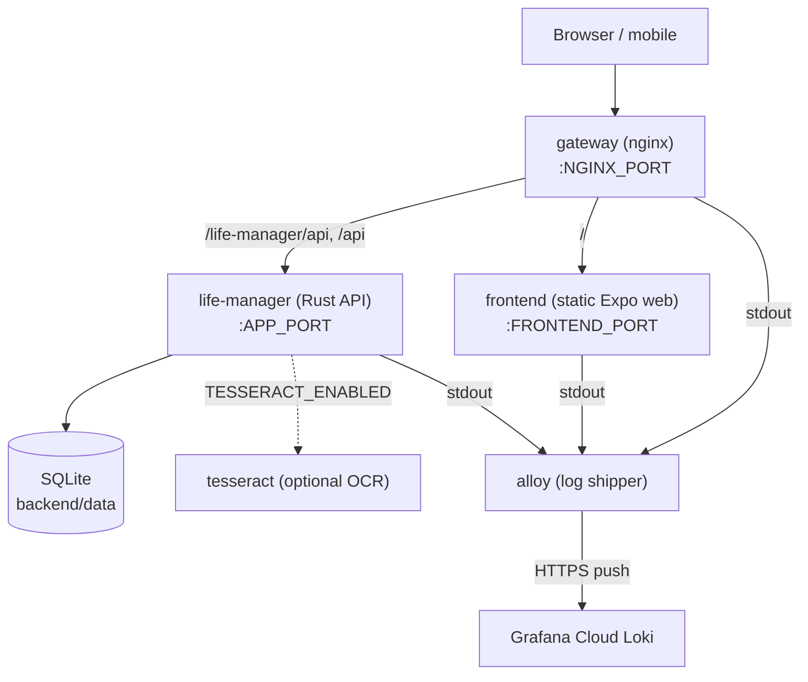
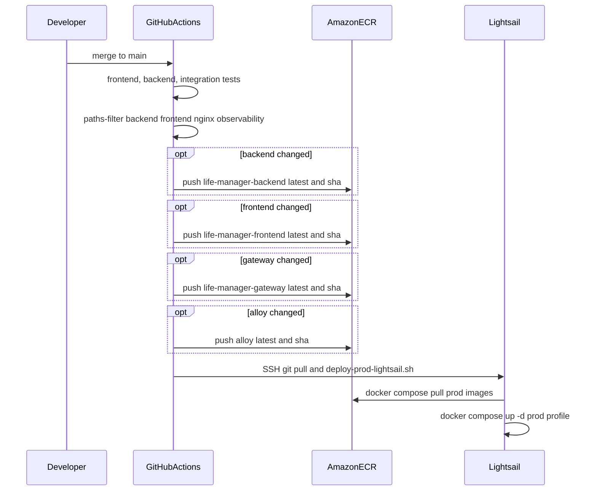

# Architecture

Overview of the Life Manager stack: backend workspace layout, HTTP routing, production deployment, and how dev/test/prod profiles differ.

## Backend workspace

The backend is a Cargo workspace. The **`mikeyjay-server`** binary crate wires Axum routes and depends on two library crates under **`backend/libs/`**. Integration tests live in **`backend/tests/`** and exercise the assembled app.

| Crate | Role |
|-------|------|
| **`mikeyjay-server`** | HTTP server entrypoint; stateless top-level routes (`/api/health`, `/api/version`); mounts tenant routers |
| **`server-host`** | Composition-only `AppBootstrap` and `TenantMount` trait — not Axum state |
| **`auth`** | Authentication router and JWT helpers; mounted under `/life-manager/api/v1/auth` |
| **`life-manager`** | First tenant crate: domain logic, Diesel/SQLite, document API; owns `LifeManagerState` and DB pool |

Each tenant crate implements `TenantMount`, builds its own state (including DB pool and migrations), and registers `.with_state()` on its nested router only. The parent router has no global Axum state.

Diesel migrations and schema live in **`backend/libs/life-manager/`** (see **`backend/diesel.toml`**) and **`backend/libs/auth/`** (see **`backend/libs/auth/diesel.toml`**). Life-manager startup runs life-manager migrations on its pool; auth migrations run when `AuthStateBuilder` builds auth state for that tenant.

## HTTP routing

In production, browsers hit the **gateway** (nginx). The gateway forwards API traffic to the Rust server and static assets to the frontend container. In dev, the Expo app usually talks directly to the backend on **`APP_PORT`**.

### Route map

| Public path | Handler |
|-------------|---------|
| `/life-manager/api/v1/auth/login` | `auth` crate — login |
| `/life-manager/api/v1/documents` | `life-manager` — list / create documents |
| `/life-manager/api/v1/documents/{id}` | `life-manager` — get document by UUID |
| `/api/health` | Top-level — liveness |
| `/api/version` | Top-level — git commit |

The v1 API prefix is resolved at runtime from the active tenant module (`frontend/lib/tenant/` → `configureApiClient`). Ops endpoints stay at **`/api/*`** so health checks do not move when product APIs are namespaced.

## Production deployment

Compose **prod** profile runs three main app services, an **`alloy`** log shipper, and an optional OCR sidecar.

Log UI is hosted by Grafana Cloud (14-day retention on free tier), not proxied through the gateway. Set **`GRAFANA_LOKI_URL`**, **`GRAFANA_LOKI_USERNAME`**, **`GRAFANA_CLOUD_API_KEY`**, and **`GRAFANA_LOKI_ENVIRONMENT`** in **`.prod.env`** (and **`.dev.env`** for local **docker-dev** testing). See [`README.md`](../README.md#grafana-cloud-logs-prod-and-docker-dev).

The **`alloy`** log shipper also runs under the **docker-dev** profile (same config; **`GRAFANA_LOKI_ENVIRONMENT=local`** in **`.dev.env`**).

The prod frontend build defaults to an empty **`EXPO_PUBLIC_API_BASE_URL`**, so the browser uses same-origin paths (via the gateway). Override with a full origin when the API is on another host (e.g. physical devices on the LAN).

See **`docker-compose.yml`** header comments and **`nginx/templates/default.conf.template`** for proxy rules.

### CI deploy to AWS (merge to `main`)

Workflow: [`.github/workflows/main.yml`](../.github/workflows/main.yml). Pull requests run tests only. A push to **`main`** runs tests, then builds and pushes each prod image to ECR only when its source tree changed (`backend/**`, `frontend/**`, `nginx/**`, `observability/**`); Lightsail deploy always runs after that job.

Image URLs are set in **`.prod.env`** at the repo root (`LIFE_MANAGER_*_IMAGE`). The deploy script is [`scripts/deploy-prod-lightsail.sh`](../scripts/deploy-prod-lightsail.sh).

## Dev, test, and prod profiles

```mermaid
flowchart TB
  subgraph dev["dev profile"]
    dev_be["Backend: cargo run on host\n:APP_PORT (3000)"]
    dev_fe["Frontend: npx expo start on host\n:8080"]
    dev_url["API URL: http://localhost:3000"]
    dev_be --- dev_fe
    dev_fe --> dev_url
  end

  subgraph dockerDev["docker-dev profile"]
    dd_compose["Compose: docker-dev profile"]
    dd_be["life_manager_dev\ncargo run + baked source"]
    dd_fe["frontend_dev\nExpo development target"]
    dd_env[".dev.env"]
    dd_compose --> dd_be
    dd_compose --> dd_fe
    dd_env --> dd_compose
    dd_fe -->|"EXPO_PUBLIC_API_BASE_URL"| dd_be
  end

  subgraph test["test profile"]
    test_be["Backend: cargo build only\n(no server started)"]
    test_fe["Frontend: Expo on host"]
    test_compose["Compose: none"]
  end

  subgraph prod["prod profile"]
    prod_gw["Entry: gateway :NGINX_PORT (80)"]
    prod_fe["frontend container (static)"]
    prod_be["life-manager container\n:APP_PORT"]
    prod_url["API URL: same origin as gateway\n(relative /life-manager/api/v1/...)"]
    prod_gw --> prod_fe
    prod_gw --> prod_be
    prod_fe --> prod_url
  end
```

**`build_and_start_app.sh`** and **`backend/start_backend.sh`** select a profile; each loads **`.<profile>.env`** at the repo root (**`docker-dev`** loads **`.dev.env`**).

| Profile | Backend | Frontend | Compose services | Typical API base |
|---------|---------|----------|------------------|------------------|
| **dev** | Host **`cargo run`** | Host Expo | *(none)* | `http://localhost:3000` |
| **docker-dev** | Container **`life_manager_dev`** | Container **`frontend_dev`** | `life_manager_dev`, `frontend_dev`, `alloy` | `http://localhost:3000` |
| **test** | **`cargo build`** only | Host Expo | *(none)* | N/A (integration tests spin up the app) |
| **prod** | Container **`life-manager`** | Container **`frontend`** via **`gateway`** | `life-manager`, `frontend`, `gateway`, `alloy` | Same origin as gateway (empty **`EXPO_PUBLIC_API_BASE_URL`**) |

More detail: [`README.md`](../README.md) (how to run), [`development_faq.md`](development_faq.md) (API URLs, mobile, TLS).
