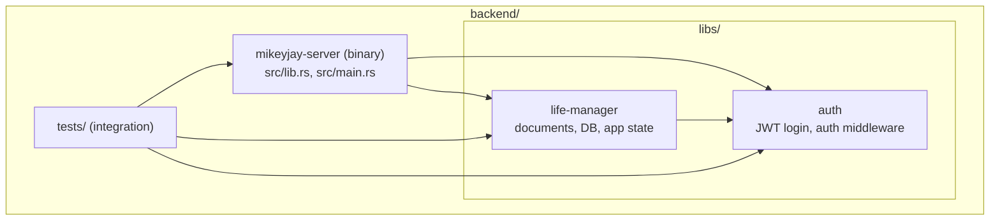
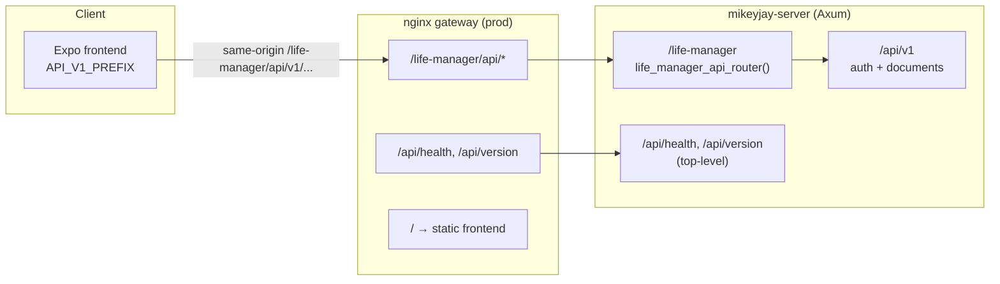
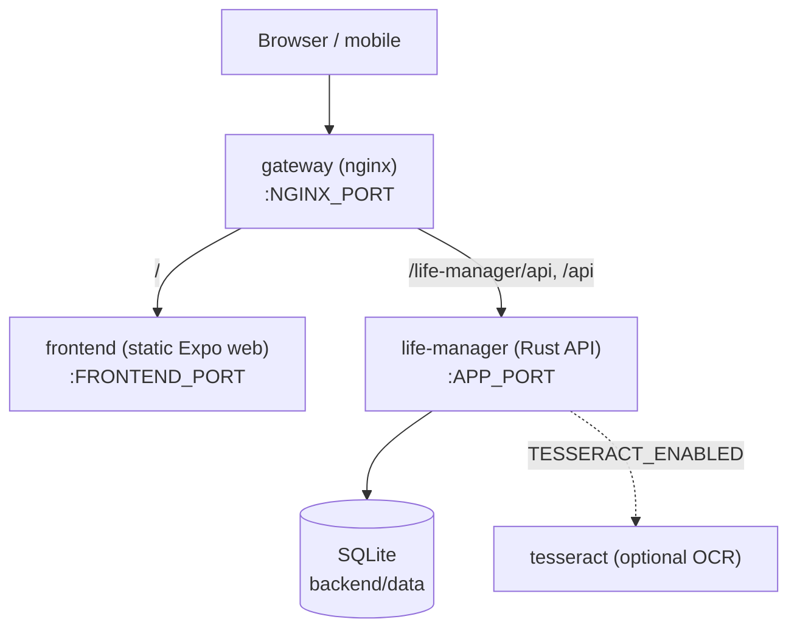
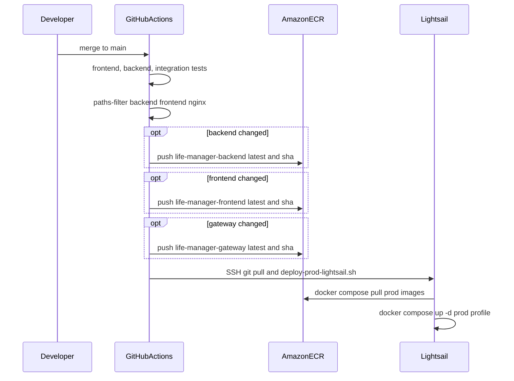
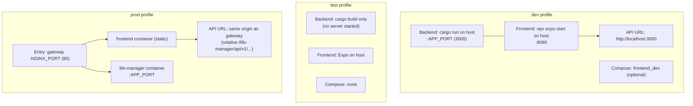

# Architecture

Overview of the Life Manager stack: backend workspace layout, HTTP routing, production deployment, and how dev/test/prod profiles differ.

## Backend workspace

The backend is a Cargo workspace. The **`mikeyjay-server`** binary crate wires Axum routes and depends on two library crates under **`backend/libs/`**. Integration tests live in **`backend/tests/`** and exercise the assembled app.

| Crate | Role |
|-------|------|
| **`mikeyjay-server`** | HTTP server entrypoint; top-level routes (`/api/health`, `/api/version`, `/life-manager/...`) |
| **`auth`** | Authentication router and JWT helpers; mounted under `/life-manager/api/v1/auth` |
| **`life-manager`** | Domain logic, Diesel/SQLite, document API; nests `/api/v1` feature routers |

Diesel migrations and schema live in **`backend/libs/life-manager/`** (see **`backend/diesel.toml`**).

## HTTP routing

In production, browsers hit the **gateway** (nginx). The gateway forwards API traffic to the Rust server and static assets to the frontend container. In dev, the Expo app usually talks directly to the backend on **`APP_PORT`**.

### Route map

| Public path | Handler |
|-------------|---------|
| `/life-manager/api/v1/auth/login` | `auth` crate — login |
| `/life-manager/api/v1/documents` | `life-manager` — list / create documents |
| `/life-manager/api/v1/documents/{id}` | `life-manager` — get document by UUID |
| `/api/health` | Top-level — liveness |
| `/api/version` | Top-level — git commit |

The v1 API prefix is defined once in the frontend as **`API_V1_PREFIX`** (`frontend/constants/config.ts`). Ops endpoints stay at **`/api/*`** so health checks do not move when product APIs are namespaced.

## Production deployment

Compose **prod** profile runs three main services plus an optional OCR sidecar.

The prod frontend build defaults to an empty **`EXPO_PUBLIC_API_BASE_URL`**, so the browser uses same-origin paths (via the gateway). Override with a full origin when the API is on another host (e.g. physical devices on the LAN).

See **`docker-compose.yml`** header comments and **`nginx/templates/default.conf.template`** for proxy rules.

### CI deploy to AWS (merge to `main`)

Workflow: [`.github/workflows/main.yml`](../.github/workflows/main.yml). Pull requests run tests only. A push to **`main`** runs tests, then builds and pushes each prod image to ECR only when its source tree changed (`backend/**`, `frontend/**`, `nginx/**`); Lightsail deploy always runs after that job.

Image URLs are set in **`.prod.env`** at the repo root (`LIFE_MANAGER_*_IMAGE`). The deploy script is [`scripts/deploy-prod-lightsail.sh`](../scripts/deploy-prod-lightsail.sh).

## Dev, test, and prod profiles

**`build_and_start_app.sh`** and **`backend/start_backend.sh`** select a profile; each loads **`.<profile>.env`** at the repo root.

| Profile | Backend | Frontend | Compose services | Typical API base |
|---------|---------|----------|------------------|------------------|
| **dev** | Host **`cargo run`** | Host Expo | `frontend_dev` (optional) | `http://localhost:3000` |
| **test** | **`cargo build`** only | Host Expo | *(none)* | N/A (integration tests spin up the app) |
| **prod** | Container **`life-manager`** | Container **`frontend`** via **`gateway`** | `life-manager`, `frontend`, `gateway` | Same origin as gateway (empty **`EXPO_PUBLIC_API_BASE_URL`**) |

More detail: [`README.md`](../README.md) (how to run), [`development_faq.md`](development_faq.md) (API URLs, mobile, TLS).
